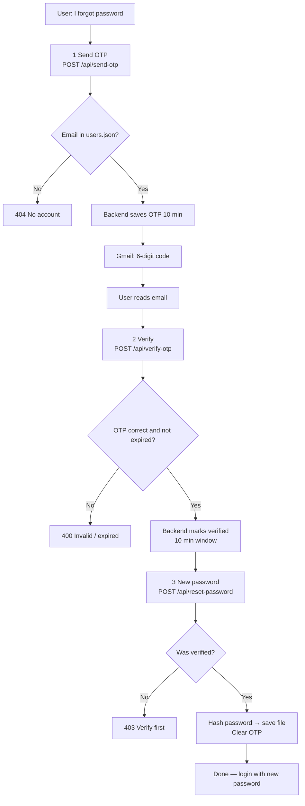

# Forgot password — easy flow

Follow the arrows. **Setup** you do once. **Reset** you do each time someone forgets their password.

---

## One-time setup (before anything works)

```
┌─────────────────────────────────────────────────────────────┐
│  1. Google Account → turn ON 2-Step Verification            │
└───────────────────────────────┬─────────────────────────────┘
                                ▼
┌─────────────────────────────────────────────────────────────┐
│  2. Google → App passwords → create → copy 16 letters       │
│     (remove spaces when you paste)                          │
└───────────────────────────────┬─────────────────────────────┘
                                ▼
┌─────────────────────────────────────────────────────────────┐
│  3. Open backend/.env                                        │
│     SMTP_USER=your@gmail.com                                 │
│     SMTP_PASS=16charsnopaces                                 │
│     SMTP_FROM=your@gmail.com                                 │
└───────────────────────────────┬─────────────────────────────┘
                                ▼
┌─────────────────────────────────────────────────────────────┐
│  4. Save .env → Stop backend (Ctrl+C) → npm run dev again   │
└─────────────────────────────────────────────────────────────┘
```

---

## Each time someone resets password (the real flow)

```
     YOU                          BACKEND                    EMAIL
      │                              │                         │
      │  ① POST /api/send-otp        │                         │
      │     { "email": "..." }       │                         │
      ├─────────────────────────────►│  saves OTP (10 min)      │
      │                              ├────────────────────────►│ sends 6-digit code
      │                              │                         │
      │  open inbox / spam           │                         │
      │◄────────────────────────────────────────────────────────┤
      │                              │                         │
      │  ② POST /api/verify-otp      │                         │
      │     { "email", "otp" }       │                         │
      ├─────────────────────────────►│  OK? → "verified" slot   │
      │◄─────────────────────────────┤  (10 min to finish)      │
      │     valid: true              │                         │
      │                              │                         │
      │  ③ POST /api/reset-password │                         │
      │     { "email", "newPassword" }│                         │
      ├─────────────────────────────►│  bcrypt → users.json     │
      │                              │  delete OTP from memory  │
      │◄─────────────────────────────┤                         │
      │     success                  │                         │
      ▼                              ▼                         ▼
   Done                         User can log in            (no more OTP)
```

**Rules (easy memory):**

| Step | You must… |
|------|-----------|
| ① | Email exists in `data/users.json` |
| ② | Use the **same** email + code from Gmail **within 10 min** |
| ③ | Only **after** ② succeeded; finish **within ~10 min** |

---

## Diagram (same flow, visual)



*(If your editor doesn’t show the diagram, use the ASCII flow above — same steps.)*

---

## Checklist (copy & tick)

**Setup (once)**  
- [ ] 2-Step Verification on Google  
- [ ] App password created (16 chars, no spaces in `.env`)  
- [ ] `backend/.env` filled + saved  
- [ ] Backend restarted  

**One reset**  
- [ ] ① `send-otp` with real account email  
- [ ] Got email (check spam)  
- [ ] ② `verify-otp` with that code  
- [ ] ③ `reset-password` with new password  

---

## Quick commands (same order as the flow)

Set once in PowerShell:

```powershell
$base = "http://localhost:4000/api"
$email = "admin@pos.com"   # must exist in data/users.json
```

Then run **① → ② → ③** in order:

```powershell
# ①
Invoke-RestMethod -Method Post -Uri "$base/send-otp" -ContentType "application/json" -Body (@{ email = $email } | ConvertTo-Json)

# ②  (put the real OTP from email)
Invoke-RestMethod -Method Post -Uri "$base/verify-otp" -ContentType "application/json" -Body (@{ email = $email; otp = "123456" } | ConvertTo-Json)

# ③
Invoke-RestMethod -Method Post -Uri "$base/reset-password" -ContentType "application/json" -Body (@{ email = $email; newPassword = "MyNewPass1" } | ConvertTo-Json)
```

More detail: **`FORGOT_PASSWORD_API.md`**.
